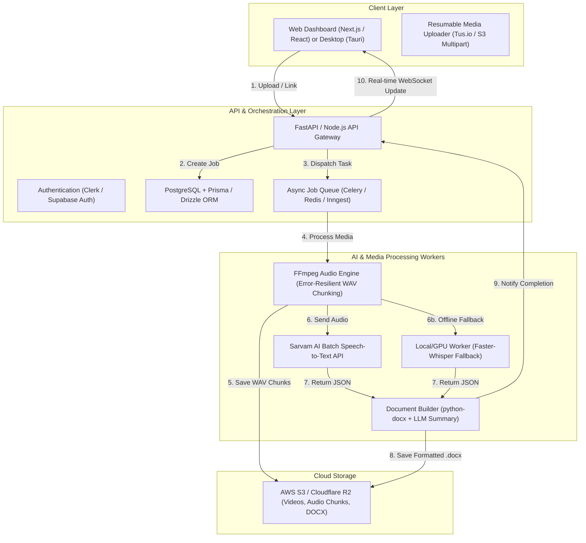

# 🚀 VoxDoc AI / ScribeFlow: Product Architecture & Build Guide

> [!IMPORTANT]
> **Executive Summary:** This document is the comprehensive engineering and product blueprint for transforming your standalone Python scripts (**Video-to-Audio extraction** + **Sarvam AI / Whisper Speech-to-Text**) into a production-grade **AI Transcription & Content Studio SaaS / Desktop Product**.

---

## 💡 1. Product Vision & Value Proposition

### 🎯 The Problem
Course creators, educators, podcasters, and businesses spend hours manually converting video recordings (Google Drive, Zoom, YouTube, Loom) into readable notes, course manuals, and documentation. Existing tools either struggle with **long-form audio (1+ hours)**, fail on **Indic/Regional languages & accents**, or lack **custom Word (.docx) formatting**.

### 🌟 The Solution: "VoxDoc AI" (or "ScribeFlow")
An all-in-one **AI Media-to-Document Studio** that:
1. **Ingests Anywhere**: Direct uploads (up to 10GB), Google Drive links, YouTube, and Zoom recordings.
2. **Resilient Processing**: Automatically handles corrupted MP4 streams, extracts audio, and splits long files into 45-minute chunks without quality loss.
3. **Hybrid AI Transcription**: Utilizes **Sarvam AI** for unmatched accuracy in Indian languages/English accents and **Faster-Whisper** for offline/free processing.
4. **Smart Document Generation**: Converts raw transcripts into structured, beautifully formatted Word documents (`.docx`) with speaker tags, timestamps, and AI-generated executive summaries.

---

## 🏛️ 2. System Architecture & Tech Stack

We offer two deployment models depending on your target market: **Cloud SaaS (Web App)** and **Local Desktop App (Privacy-First)**.



### 🛠️ Recommended Technology Stack

| Component | Cloud SaaS Model (Recommended for Scaling) | Local Desktop Model (Recommended for Offline/Privacy) |
| :--- | :--- | :--- |
| **Frontend UI** | **Next.js 14 (App Router)** + **Tailwind CSS** + **Shadcn UI** | **Tauri (Rust)** + **React** + **Vite** + **Tailwind CSS** |
| **Backend API** | **Python (FastAPI)** - High performance, async, native AI SDKs | **Python Sidecar** bundled inside Tauri app |
| **Database** | **PostgreSQL** (via **Supabase** or **Neon**) + **Drizzle ORM** | **SQLite** (local file-based storage) |
| **Job Queue** | **Celery** + **Redis** (or **Inngest** / **Argo Workflows**) | Native Python `asyncio` / Background Threads |
| **Storage** | **Cloudflare R2** or **AWS S3** (Zero egress fees on R2) | Local Filesystem (`~/Documents/VoxDoc/`) |
| **Auth & Billing** | **Clerk** or **Supabase Auth** + **Stripe / Razorpay** | License Key Verification (e.g., **Lemon Squeezy**) |
| **Media Engine** | **FFmpeg** (with `-err_detect ignore_err` resilience) | **FFmpeg** static binary bundled with app |
| **AI Transcription** | **Sarvam AI Batch API** (Primary) + **OpenAI Whisper** | **Faster-Whisper** (INT8/FP16 local model) + **Sarvam AI** |

---

## ⚙️ 3. Core Product Workflow & Pipeline

### Step 1: Media Ingestion & Validation
* **Direct Upload**: Support large file uploads via chunked multipart uploading.
* **Cloud Import**: Paste a Google Drive shareable link or YouTube URL. The backend streams the file directly to storage without loading it all into server RAM.
* **Pre-flight Check**: Validate audio tracks, codec compatibility, and calculate exact media duration.

### Step 2: Resilient Audio Extraction & Chunking
* Use our hardened FFmpeg command to bypass AAC decoding errors and corrupted containers:
  ```bash
  ffmpeg -y -err_detect ignore_err -fflags +discardcorrupt -i input.mp4 -f segment -segment_time 2700 -ar 16000 -ac 1 -c:a pcm_s16le chunk_%02d.wav
  ```
* Automatically splits audio exceeding 45 minutes into clean 16kHz mono WAV chunks.

### Step 3: Transcription Orchestration
* **Sarvam AI Engine**: Submits chunks in parallel to Sarvam AI's batch API (`saarika:v2` or latest model).
* **Automatic Retry & Fallback**: If an API endpoint fails or rate-limits, automatically fall back to local `faster-whisper` or re-queue the task.

### Step 4: Intelligent Post-Processing & Docx Generation
* **Speaker Diarization**: Label speakers (e.g., *Speaker 1*, *Speaker 2* or custom names like *Instructor*, *Student*).
* **LLM Polish (Optional)**: Pass raw transcripts through Claude / GPT-4o-mini to generate:
  * 📋 **Executive Summary**
  * 🎯 **Key Takeaways & Bullet Points**
  * ❓ **Q&A / Action Items**
* **Template Engine**: Generate branded `.docx` files with custom fonts, cover pages, headers, and spacing using `python-docx`.

---

## 🗄️ 4. Database Schema (PostgreSQL / Drizzle ORM)

```sql
-- Users Table
CREATE TABLE users (
    id UUID PRIMARY KEY DEFAULT gen_random_uuid(),
    email VARCHAR(255) UNIQUE NOT NULL,
    full_name VARCHAR(255),
    tier VARCHAR(50) DEFAULT 'free', -- 'free', 'pro', 'enterprise'
    credits_remaining INTEGER DEFAULT 60, -- in transcription minutes
    created_at TIMESTAMP WITH TIME ZONE DEFAULT CURRENT_TIMESTAMP
);

-- Transcription Jobs Table
CREATE TABLE transcription_jobs (
    id UUID PRIMARY KEY DEFAULT gen_random_uuid(),
    user_id UUID REFERENCES users(id) ON DELETE CASCADE,
    title VARCHAR(255) NOT NULL,
    source_type VARCHAR(50) NOT NULL, -- 'upload', 'gdrive', 'youtube'
    source_url TEXT,
    file_size_bytes BIGINT,
    duration_seconds INTEGER,
    status VARCHAR(50) DEFAULT 'pending', -- 'pending', 'extracting', 'transcribing', 'generating_doc', 'completed', 'failed'
    ai_engine VARCHAR(50) DEFAULT 'sarvam', -- 'sarvam', 'whisper'
    error_message TEXT,
    docx_url TEXT,
    json_url TEXT,
    created_at TIMESTAMP WITH TIME ZONE DEFAULT CURRENT_TIMESTAMP,
    updated_at TIMESTAMP WITH TIME ZONE DEFAULT CURRENT_TIMESTAMP
);

-- Audio Chunks Sub-tasks
CREATE TABLE job_chunks (
    id UUID PRIMARY KEY DEFAULT gen_random_uuid(),
    job_id UUID REFERENCES transcription_jobs(id) ON DELETE CASCADE,
    chunk_index INTEGER NOT NULL,
    file_path TEXT NOT NULL,
    sarvam_job_id VARCHAR(255),
    status VARCHAR(50) DEFAULT 'pending',
    transcript_text TEXT,
    created_at TIMESTAMP WITH TIME ZONE DEFAULT CURRENT_TIMESTAMP
);
```

---

## 🎨 5. UI/UX Design System & Aesthetics

To wow users at first glance, avoid generic layouts. Implement a **vibrant dark mode with glassmorphism**:
* **Color Palette**:
  * **Background**: Deep Slate / Obsidian (`#0B0F19`)
  * **Primary Accent**: Electric Indigo (`#6366F1`) to Neon Violet (`#8B5CF6`) gradient
  * **Success / Ready**: Cyber Green (`#10B981`)
  * **Card / Surface**: Translucent Glass (`rgba(255, 255, 255, 0.03)`) with 1px subtle border (`rgba(255, 255, 255, 0.08)`) and backdrop blur (`backdrop-blur-md`).
* **Typography**: **Inter** or **Outfit** for clean, modern headings and numbers.
* **Micro-animations**:
  * Glowing pulse effect on active transcription cards.
  * Smooth progress bar transitions with percentage counters.
  * Drag-and-drop zone that illuminates on file hover.

---

## 📈 6. Monetization & Business Models

| Tier | Price | Features | Target Audience |
| :--- | :--- | :--- | :--- |
| **Starter / Free** | **$0 / mo** | • 60 mins of transcription/month<br>• Standard Sarvam AI engine<br>• Basic `.docx` export | Casual users, students, testing |
| **Creator Pro** | **$19 / mo** | • 900 mins (15 hours)/month<br>• Google Drive & YouTube import<br>• Custom Word templates & Logos<br>• AI Summaries & Key Takeaways | Course creators, YouTubers, podcasters |
| **Agency / Team** | **$49 / mo** | • 3,000 mins (50 hours)/month<br>• Priority batch processing<br>• Team workspaces & shared folders<br>• API Access & Webhooks | Media agencies, educational institutions |

---

## 🗺️ 7. Step-by-Step Implementation Roadmap

### 🏁 Phase 1: Interactive MVP Prototype (Available Now!)
* Build a standalone **Streamlit Web Application** (`app.py`) that wraps your existing Python scripts.
* Allows users to upload videos or input Google Drive links and download `.docx` directly from their browser.
* **Time to launch**: ~1 Day (Code provided in the next section!).

### 🚀 Phase 2: Cloud Backend & Asynchronous Queue
* Wrap the extraction and Sarvam AI pipeline in **FastAPI** REST endpoints (`/api/v1/jobs/create`, `/api/v1/jobs/{id}/status`).
* Set up **Celery + Redis** (or a simple background thread pool for early MVP) to process videos without HTTP timeouts.
* Set up **Amazon S3** or **Cloudflare R2** bucket for storing audio chunks and generated Word docs.

### 💻 Phase 3: Premium Web Dashboard (Next.js)
* Create a Next.js 14 frontend with **Clerk Authentication**.
* Build the real-time dashboard showing active jobs, historical transcripts, and billing status.
* Integrate **Razorpay** (for India) and **Stripe** (global) for subscription billing.

### 📦 Phase 4: Desktop App Launch (Tauri + React)
* Package the frontend and Python engine using **Tauri** for Windows and Mac.
* Market as a **"100% Private, Offline-capable AI Scribe"** for sensitive legal, medical, and corporate data.

---

## 💻 8. Ready-to-Run MVP Prototype Code (Streamlit)

You can launch a working web product **today** by running the included `app.py` script. It provides a clean web UI over your entire pipeline!

```bash
# Install dependencies
pip install streamlit python-docx requests gdown faster-whisper

# Run the Web App Product
streamlit run app.py
```
*(See `app.py` in your project folder for the complete working product code!)*
